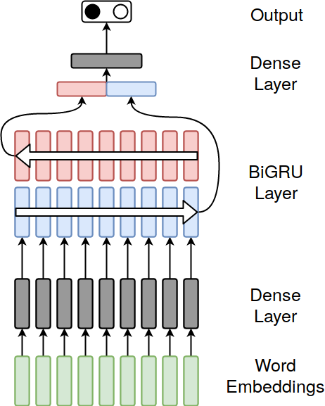
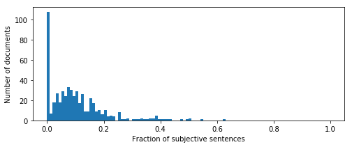

Subjectivity detection with Bi-RNNs
===================================

Installation
------------

```bash
virtualenv --python=/usr/bin/python3 .env 
source .env/bin/activate 
pip install -r requirements.txt
wget http://nlulite.com/download/glove ./data/word_embeddings/
```

Running a simple example
------------------------
In the installed environment you can either provide the text as an argument: 
```bash
python -m subjectivity.classify this is a test.
```
Or pipe a text file from the command line: 
```bash
python -m subjectivity.classify < data/random_text.txt
```

The output will look like the following:
```text
OBJECTIVE SENTENCES
<list of objective sentences in the text>

SUBJECTIVE SENTENCES
<list of subjective sentences in the text>
```

Training, cross-validating and testing
--------------------------------------

Trains for 40 epochs 
```bash
python -m subjectivity.train
```

Test epoch 29 
```bash
python -m subjectivity.test
```

10-fold cross validation on the training dataset
```bash
python -m subjectivity.cross_validate
```

\newpage

Network Structure
-----------------

The network structure is as in Fig. 1

{height=50%}

A text is divided into sentences. Each sentence is tokenized into words, and 
each word vector is given as an input to the network.

For the word embeddings I have used the 50-dim Glove vectors trained on 
[[Wikipedia 2014](https://nlp.stanford.edu/projects/glove/)].

Each word embeddings goes through a dense layer. The result is then fed to a bi-directional GRU, 
effectively composed by a forward GRU and a backward one. 
The last state of the forward GRU and first state of the backward GRU are 
concatenated and fed into one last dense layer, which is finally 
projected with a softmax into a binary vector.

This last vector represents the predicted class: [1, 0] predicts a subjective sentence, 
[0, 1] an objective one.

|Layer | dimension  |
|------|:----------:|
|Word embeddings     | 50 |
|Dense layer     | 25 |
|GRU memory     | 100 |
|GRU stacks     | 1 |
|Final hidden dense layer     | 200 |
|Output  size    | 2 |
|Minibatch size    | 10 |
|Dropout rate    | 0.3 |

\newpage

Training dataset and evaluation
-------------------------------

I used Cornell's [[Subjectivity dataset v1.0](http://www.cs.cornell.edu/people/pabo/movie-review-data/)], 
which is based on movie reviews taken from IMDB and RottenTomatoes. The dataset contains
5000 subjective sentences and 5000 objective ones (according to their classification).
 
In order to train and evaluate the result, I have split the dataset into a training 
set of 4500 sentences for each class (a total of 9000 sentences) and a test set of 
500 sentences for each class (1000 sentences total).
  
The hyperparameter evaluation has been done by using 10-fold cross validation over the 
training set. Maybe cross validation is a bit overkill for the task at hand, but I wanted
to compare my results with the one in the [[Liang and Zhang](https://arxiv.org/abs/1611.01884v3)],
where they also use 10 fold cross validation.


Motivation and discussion
-------------------------
The current network structure has been taken from [[Augensten *et al*](https://aclweb.org/anthology/D/D16/D16-1084.pdf)], 
while the training dataset is the same as in [[Liang and Zhang](https://arxiv.org/abs/1611.01884v3)].
 
This last article uses a system of convolutional nets to decrease the dimension of the input embeddings. 
Moreover, all the output states of the RNN are used to classify the output, whereas in
[[Augensten *et al*](https://aclweb.org/anthology/D/D16/D16-1084.pdf)] only the initial and final state
of the RNN are used.
 
I decided to use [[Augensten *et al*](https://aclweb.org/anthology/D/D16/D16-1084.pdf)]'s
network topology because it contains less parameters than the one in 
[[Liang and Zhang](https://arxiv.org/abs/1611.01884v3)]. The training data is not abundant and a 
model with less parameters should perform better.

My feeling is that the training data is not quite as big as it should be, and most of the
credit for the results comes from the quality of the pre-trained word embeddings.

\newpage

Results
-------
The best results for the 10-fold *cross validation* are found in the 29^th epoch of training  

| precision | recall | f1|
|-----------|--------|---|
|0.913 | 0.914 | 0.913|

Whereas the results on the *test set* are 

| precision | recall | f1| accuracy |
|-----------|--------|---|---|
|0.912 | 0.895 | 0.903| 0.904|


For comparison the accuracy in [[Liang and Zhang](https://arxiv.org/abs/1611.01884v3)] is 
0.943, and the state-of-the-art is 0.95 accuracy in [[Zhao and Mao](http://ieeexplore.ieee.org/document/7755816/)].

I believe that the main reason for the lower quality in the results is due to the fact that I 
used lower quality word embeddings. Using the Glove 300-dim Common Crawl would have probably given better 
results (see FAQ answer to question 2).

Another reason is that I optimised for F1 score, not for accuracy.

Additional Material
-------------------
Two Jupyter notebooks can be found in `./notes/Jupyter/`. 

The first file `simple_test_classification.ipynb` is about using the high level classifier
on a simple sentence. The second file plays with the classification of texts taken from the 
[[MPQA opinion corpus v1.2](http://mpqa.cs.pitt.edu/corpora/mpqa_corpus/)].
These are freely available texts (used for subjectivity evaluation), mostly related to news.


The second file `many_files_classification.ipynb` is about measuring the subjectivity of documents.
In order to classifty texts I have tried to measure the fraction of subjective sentences in each document.
The result is plotted in Fig. 2

{height=50%}

Naively, a document would be classified as very subjective if it contains a lot of subjective sentences.
The simple barchart in Fig. 2 however depicts a multimodal distribution of documents 
according to this classification metric. This makes sense 
because the MPQA corpus has documents from different sources, each written with a different style.
 
Document subjectivity is more complicated than sentence subjectivity and more thinking is necessary 
to achieve document level classification.

